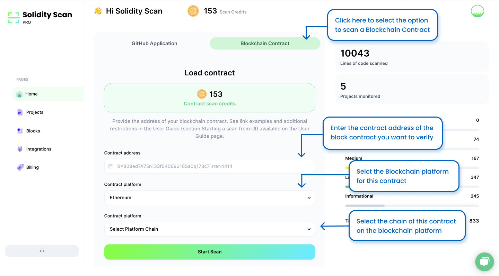
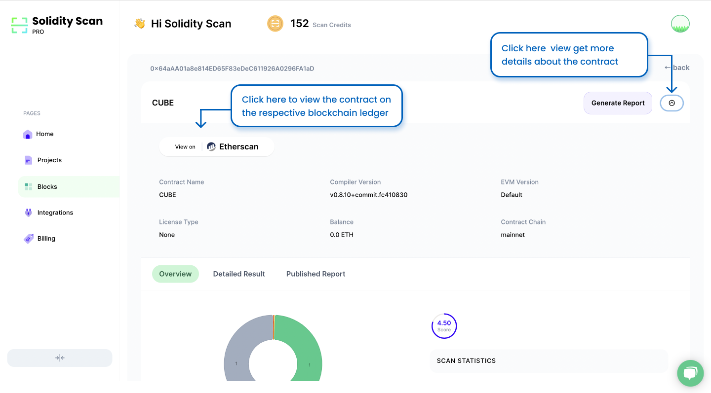

# Scanning a Deployed Contract using Solidity Scan

We also provide the functionality to scan a particular deployed contract whose codes are published on the supported explorers. The current supported chains and their respective explorers are as below.
1. Ethereum - etherscan.io
2. BSC - bscscan.com
3. Polygon - polygonscan.com
4. Fantom - ftmscan.com
5. Avalanche - snowtrace.io

Note: All major testnets are also supported. 

# Step 1: Enter the details of the contract

Enter the link to the contract from the ledger. Select the blockchain platform on which this transaction has taken place. Also, select the contract chain for this transaction.

# Step 2: View the results of the scan

On successful completion of the scan, click on it to get more details about the scan.

Refer to the Project Scan section to see how to explore the detailed result of a scan.

Click on the View button to go to the Contract on the respective explorer. Click on the dropdown to see more details about the Contract.

