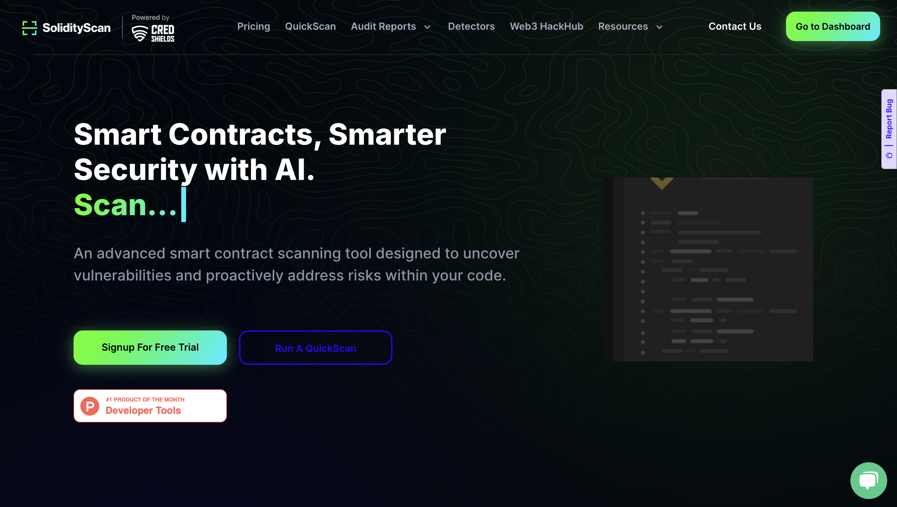
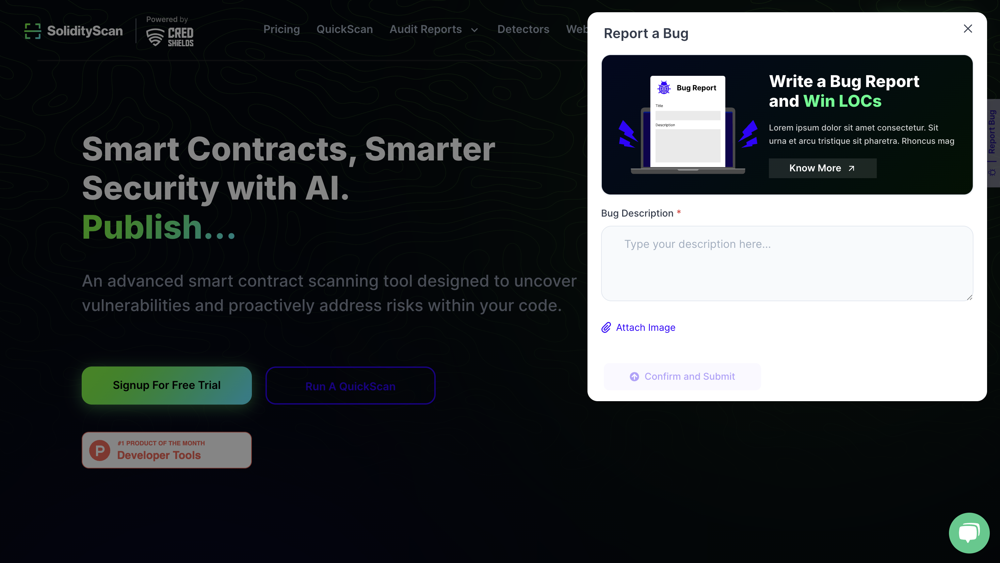

# About the Bug Report Program

CredShields is committed to building secure, seamless, and high-performing tools for the Web3 community. To ensure top-tier quality, we're launching a Bug Reporting Program that rewards contributors with LOCs — our internal reward points — for helping identify issues across our platform SolidityScan.

Whether it's a UI glitch, a broken feature, or a security concern — if you find it, report it. We value community-driven feedback and aim to improve rapidly based on it.

#### How to Report

### Go to the Report a Bug Form
- Click the "Report a Bug" button or use this link to open the form.

### Fill in the Details
- Describe the bug in as much detail as possible
- Mention which platform or page the bug occurred on
- Add steps to reproduce it, if applicable
- Upload screenshots or screen recordings if available

### Submit the Report
- Once filled, click Confirm and Submit
- Our team will review and validate the issue

**Note:** Incomplete reports or vague descriptions may not be eligible for rewards.

#### How to Claim LOCs

After your bug report is submitted and reviewed:

### Validation Phase
- Our internal team will verify the issue
- If confirmed, your submission will be tagged as Valid

### LOC Reward Issued
- Depending on the bug severity (UI, functional, critical), a corresponding LOC amount will be credited to your registered email/account

### Leaderboard & Recognition (Coming Soon)
- Top contributors will be highlighted in monthly newsletters
- Special perks and shoutouts for frequent reporters

## Start Contributing

Every bug you report helps us ship a better, safer product.

Start scanning, start reporting — and let's build secure Web3 tools together.
