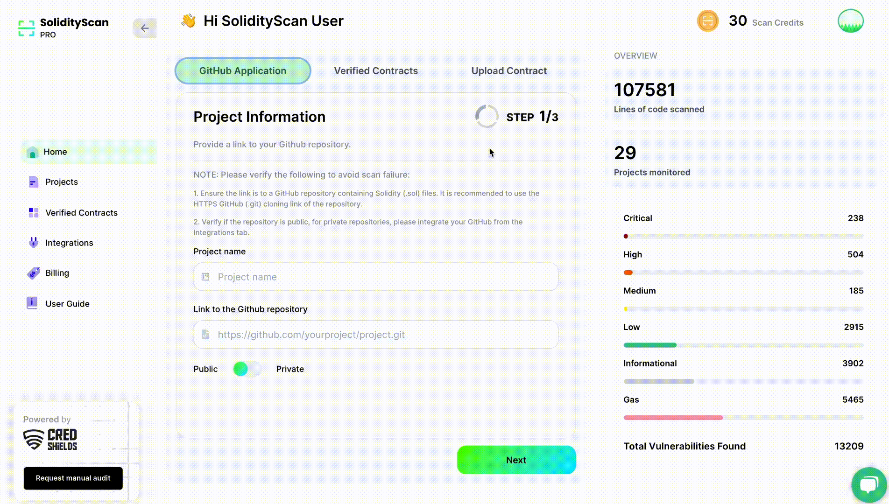

# Scanning Solidity Files using Solidity Scan

We also provide the functionality to scan upto 5 files at one time by uplaoding the solidity files (files with .sol, .Sol extension) to our platform.

# Step 1: Enter the details of the contract

Enter the name of the project.

Either click in the Upload Box or drag and drop files into the box to upload.

###### NOTE: Please follow the constraints below to avoid scan failure.

1. Files to be uploaded should be Solidity(.sol) files, preferably compiled successfully. Incorrect syntax might render incorrect results.

2. A Maximum number of files that can be uploaded is 5 and file size cannot exceed 5MB.

# Step 2: View the results of the scan

On successful completion of the scan, click on it to get more details about the scan.

Refer to the Project Scan section to see how to explore the detailed result of a scan.

###### NOTE: Scan History and Custom Settings are only present for Github Repository Scans.
