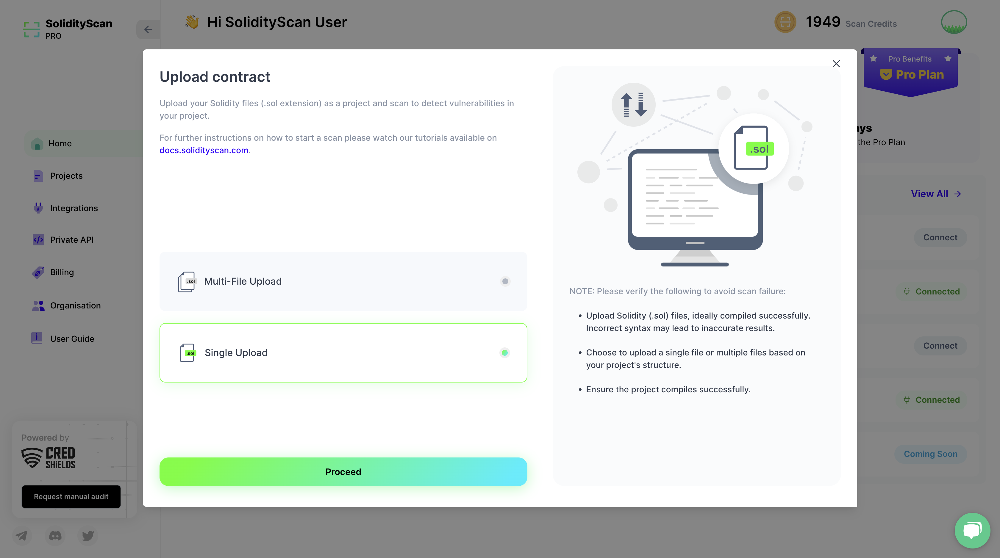
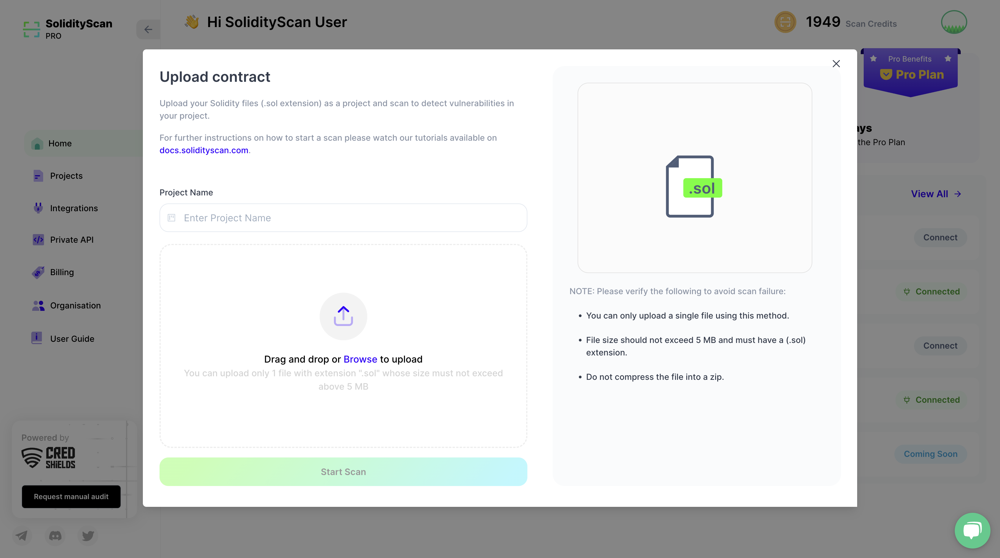
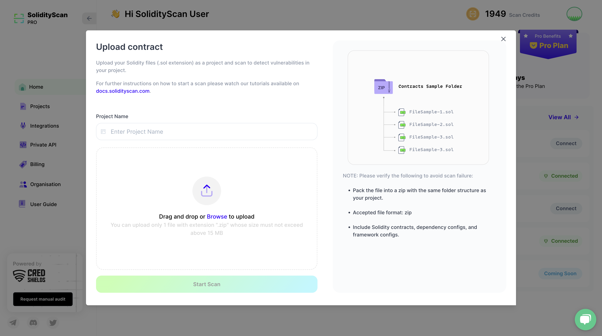

# Scanning Solidity Files using SolidityScan

We also provide the functionality to scan up to 5 files at one time by uploading the solidity files (files with .sol, .Sol extension) to our platform.

# Step 1: Please Select the Upload Type

Begin by choosing either the "Single File Upload" option if your project is a single file or the "Multi-File Upload" option if it comprises a structured directory with multiple files.

# Step 2: Enter the details of the contract

Enter the name of the project.

Either click in the Upload Box or drag and drop files into the box to upload.

If you opted for "Single File Upload" in this step, you can simply upload your Solidity file and initiate the scanning process. On the other hand, if you've selected "Multi-File Upload," you have to compress your project into a zip file and then proceed with the upload.

<!--
###### NOTE: Please follow the constraints below to avoid scan failure.

1. Files to be uploaded should be Solidity(.sol) files, preferably compiled successfully. Incorrect syntax might render incorrect results.

2. The maximum number of files that can be uploaded is 5, and file size cannot exceed 5MB. -->

# Step 3: View the results of the scan

On successful completion of the scan, click on it to get more details about the scan.

Refer to the Project Scan section to see how to explore the detailed result of a scan.

###### NOTE: Scan History and Custom Settings are only present for Online Code Repository Scans.

<!-- Watch the Tutorial on How to Scan one or multiple Solidity files (.sol extension) using SolidityScan -->
