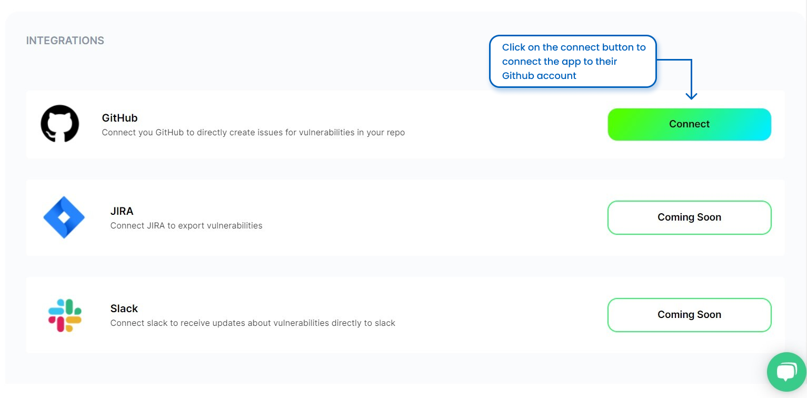
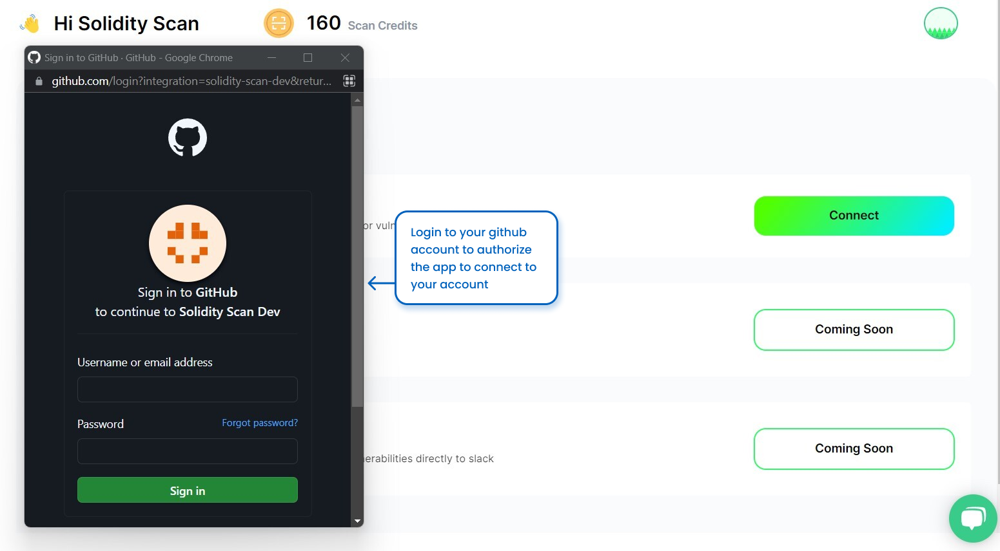
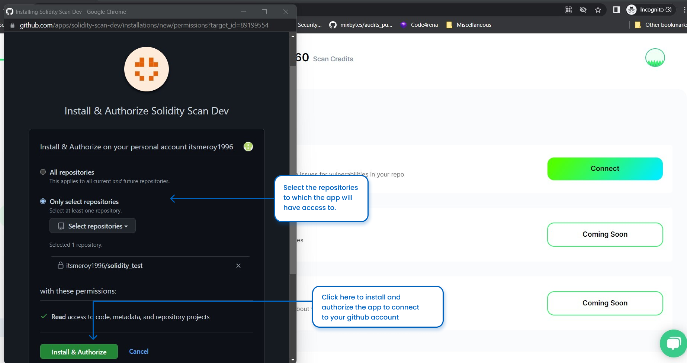

# Integrating the App with Diffrent Services

You have an option to integrate our app with you github account. In future we will also be providing the option to integrated it with Slack and JIRA.

# Step 1: Request to Connect With Github

First, Make sure you are on the Pro or Custom Plan. This Service is only available for these Plans.

Once your plan is upgraded, click on the Connect Button to send a request to Connect to Github

# Step 2: Login to Your Github Account

A Pop-up will open, asking you to login to your Github Application. 

# Step 3: Authorize your Github App

Once the login is successful, authorize the app to get data from your gihtub account like shown below.

# Step 4: View the detailed result of the scan

After you have successfully connected the app to your github account, you can see the status of the integration. You also have an option to Disconnect your github account if you want

