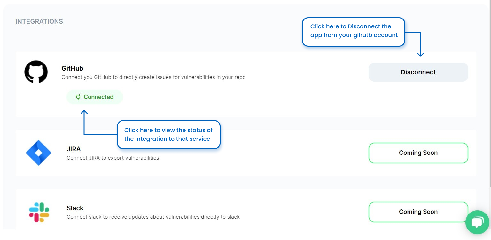

# Integrating the App with Different Services

You have an option to integrate our app with multiple platforms.
Currently, we provide you with the service to integrate with the following platforms:

1. Github
2. Bitbucket
3. Gitlab
4. Slack

In the future, we will also be providing the option to integrate it with JIRA.

To give you an understanding of the integration process of these platforms, we have provided you with an example of how to integrate our app with your Github Account.

## Step 1: Request to Connect With Github

First, make sure you are on the Pro or Custom Plan. This service is only available for these Plans.

Once your plan is upgraded, click on the Connect Button to send a request to connect to Github.

## Step 2: Login to Your Github Account

A pop-up will open, asking you to log in to your Github Application.

## Step 3: Authorize Your Github App

Once the login is successful, authorize the app to get data from your GitHub account, as shown below.

## Step 4: View the Detailed Result of the Scan

After you have successfully connected the app to your GitHub account, you can see the integration status. You also have an option to Disconnect your GitHub account if you want.

Watch this tutorial on How to Integrate your Github account with SolidityScan.

<iframe width="740" height="420" src="https://www.youtube.com/embed/ppZ-ktRcC88" title="Integrate your Github account with SolidityScan" frameborder="0" allow="accelerometer; autoplay; clipboard-write; encrypted-media; gyroscope; picture-in-picture; web-share" allowfullscreen></iframe>
