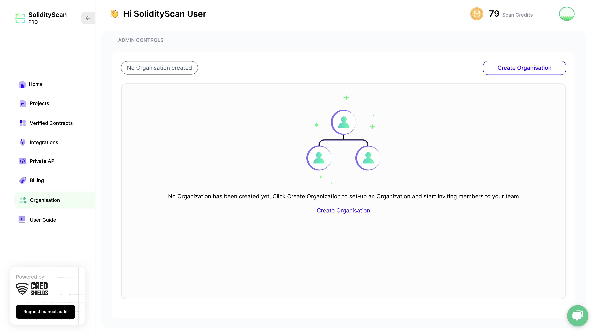
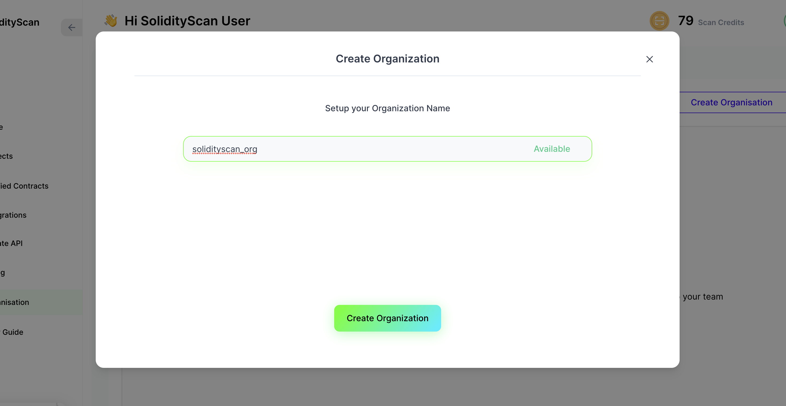
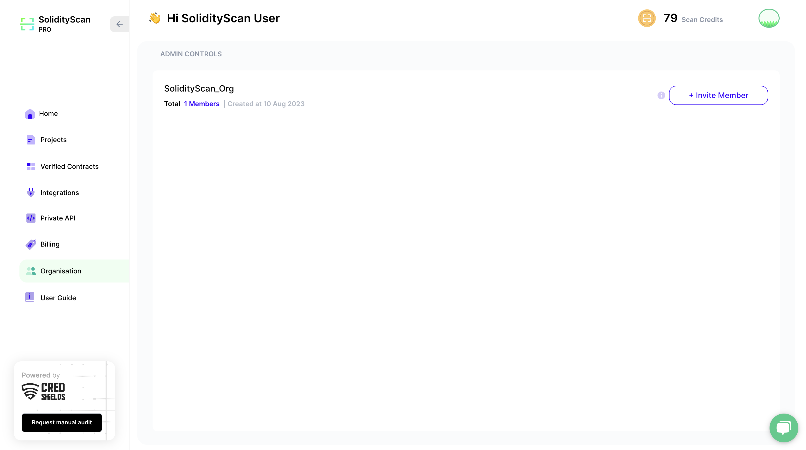
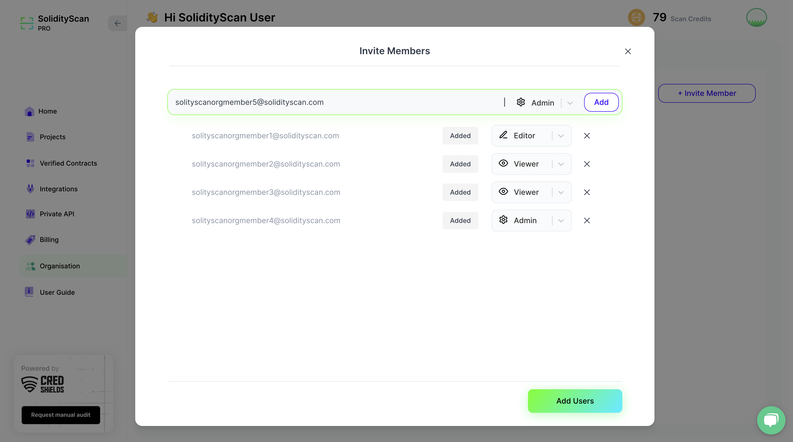
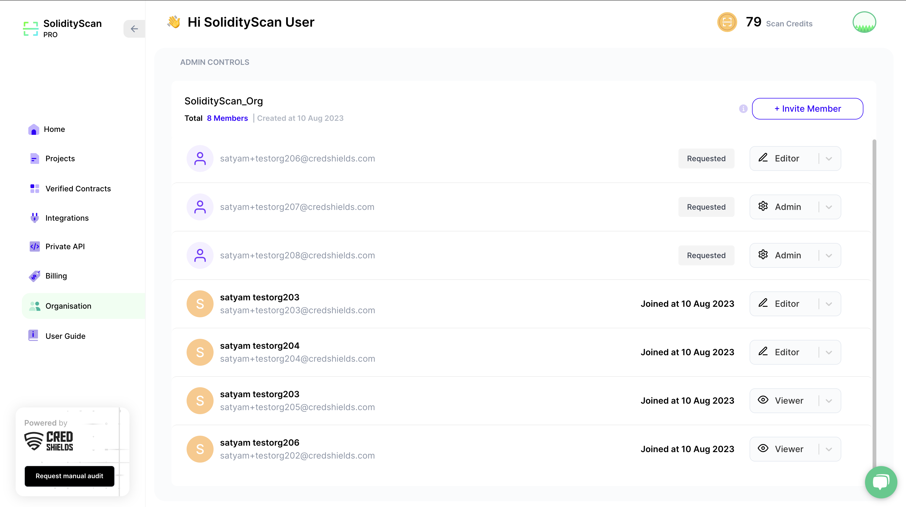

# Create and Manage Organisation

SolidityScan platform provides the feature to create and manage Organizations. You can add users to your organization and assign them roles based on the resource access you want the users to have.

This feature is available only for our Pro and Custom plan users.

###### NOTE

Members you add to the organization do not need to have an active plan to be added to your organization.

# Create an Organisation

1. Click on the Create Organisation Button.

2. Enter your Organisation Name. Once you see that the organization name you entered is available, Click on Create Organisation to send your request for creating the Organisation.

# Invite Members to your Organisation

1. Once your Organisation Creation request is approved, Click on Invite Member Button to add users to your organization.
   

2. You can add users in a batch or individually as per your requirement. Enter the email of the user and select the role you want to assign to the user. Then click on Add or press Enter to add the user
   

3. Once the batch of users you want to add is ready, Click on Add users button to send the invite to the users.

# User Roles policy for Organisation Members

Users with a **Viewer** role will be limited to viewing results and performing read actions. Users with this role cannot perform write or modify actions on the platform. They can perform the following actions:

1. They can view scan results for both Project Scans and Verified Contracts scans.
2. They can view published/unpublished reports. They also have the option to download and share PDFs of published reports.

Users with an **Editor** role have full access to perform write actions on the platform along with all the access that a Viewer has. They can perform the following actions:

1. They can start Scans and delete them as well.
2. They have access to modify bug status.
3. They can generate and publish reports for scans done.
4. They have access to view Private API keys.

Users with an **Admin** role have all the access that an Editor has, with the added privilege of managing user roles, including the ability to add or remove user roles.

Organization Members do not have access to perform the following actions:

1. They cannot make any changes related to plan updating and scan credit top-ups in the billing sections.
2. They do not have access to view the billing sections.
3. They cannot add any integrations to the platform.
4. They do not have access to Generate/Re-generate/Delete Private API keys.

# Managing your Organisation

After you have successfully created your organization, you can manage the roles of the users present in your organization. You can see the users who have accepted your organization invitation request. You also have the option to delete a user from the organization.

