# Scanning a Project using Solidity Scan

Let's go through the process of scanning a project/repository using Solidity Scan. We've tried to make this process as simple and automated as possible.

# Create an account on Solidity Scan

First, let's create an account on Solidity Scan. If you have already created an account, you can skip this o create a new account, Let's head on to: [solidityscan.com](https://solidityscan.com/signup).

# Enter the project you need to Scan

Once the account is created, you can start scanning your solidity project by following these steps:

#### STEP 1: Enter Project Information

Enter the project's name and the repository link for the project. When entering the link please verify the following to avoid scan failure:

1. Ensure the link is to a GitHub repository containing Solidity (.sol) files. It is recommended to use the HTTPS GitHub (.git) cloning link of the repository.

2. Verify if the repository is public, for private repositories, please integrate your GitHub from the Integrations tab.

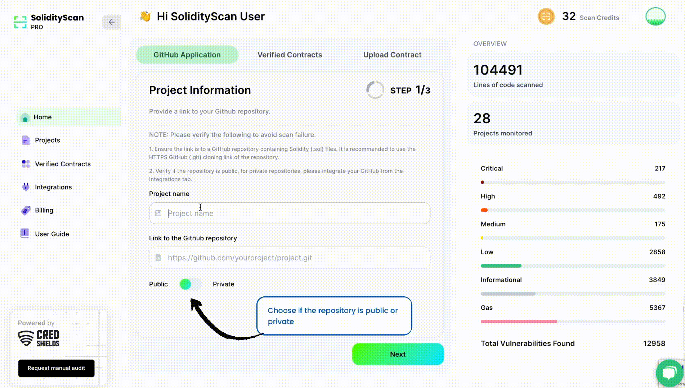

Also, select if the repository is public or private. Click on the next button to proceed to Step 2.

#### STEP 2: Select Branch and Files to be Scanned

After you have entered the github repository link, you will be asked to select a branch that contains the project which has to be scanned. By default, the default branch on your github repository will be selected.

Also you will have an option to select files and folders that you want to scan. The files and folders that are not selected will be skipped in the scanning process.

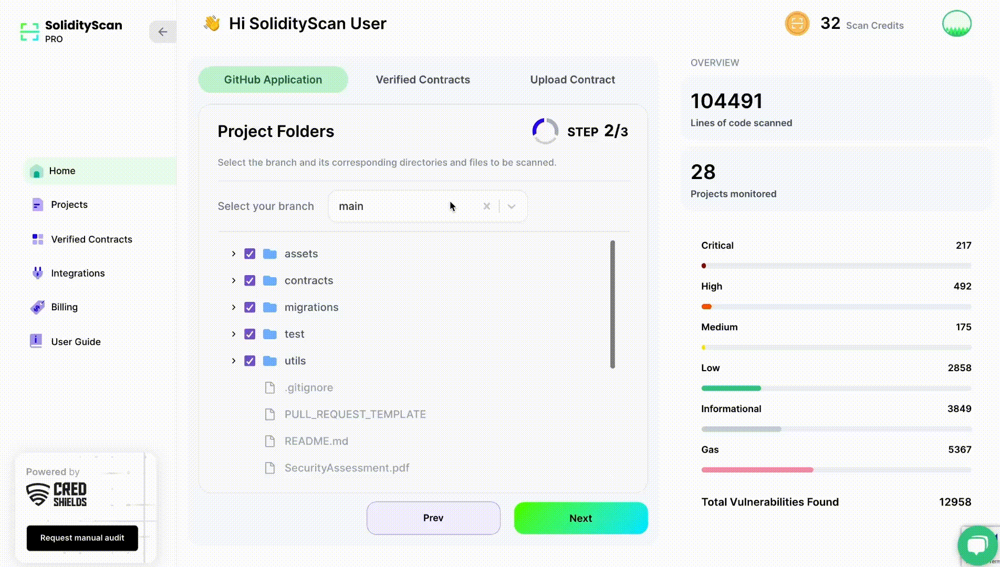

###### Note: Only solidity files (files with .sol, .Sol extension) will be scanned

Once you are done configuring your settings, click on next to proceed to Step 3.

#### STEP 3: Configure Webhooks for Github Actions

You have the option to trigger automatic scans using Github Actions. Whenever a new commit will be pushed to the branch, if webhook has been enabled then it will trigger a scan automatically to check if the new changes have any vulnerabilities present.

You can only configure webhooks for those github respository which are owned by you (user). Also this funcationality is only possible once you have connected your github account with SolidityScan Application. [Here](./integrations) are the steps to do the.

After you have configured your settings click on Start Scan Button to initiate the scan.

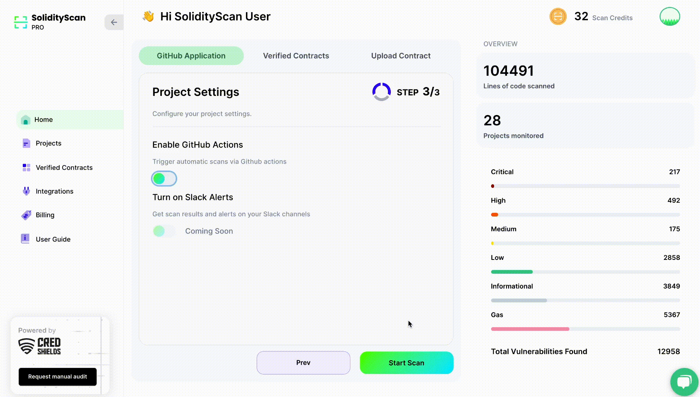

After you have started the scan, you will see the below screen.

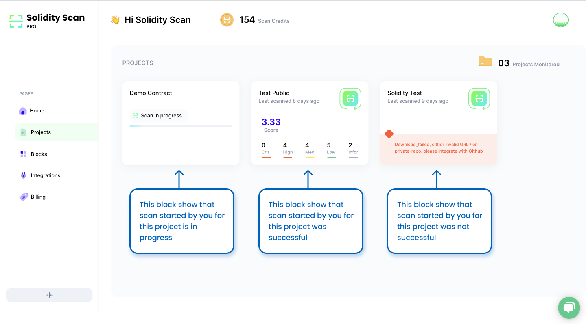

# View the results of the scan

On successful completion of the scan, click on it to get more details about the scan.

You will have an option to do a re-scan of the project. You can also view the statistics of the scan and the details of the issues found in the project.

#### Overview of the Project

You get the an understanding about how secure your project is and get an overall idea about the issue and vulnerabilities in your project. Using the quantitative scoring present here, you can draw a quick comparison about the security of the projects and how it has evolved over the time.

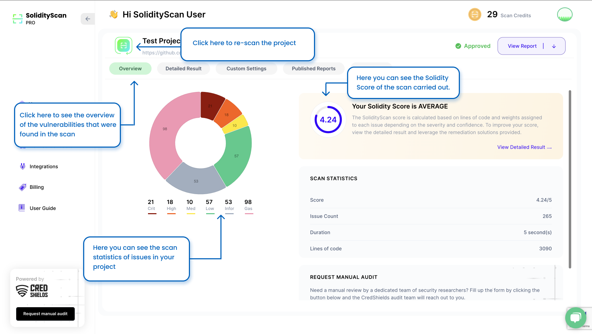

#### Detailed Result of the scan.

To get a more detailed scan result, you can navigate through the tabs. Click on the Detailed result tab to see the issues and vulnerabilities found in the scan in a detailed way.

There is an option to view vulnerability description in expanded view. You can also choose to close the description box if its obstructing the Code View.

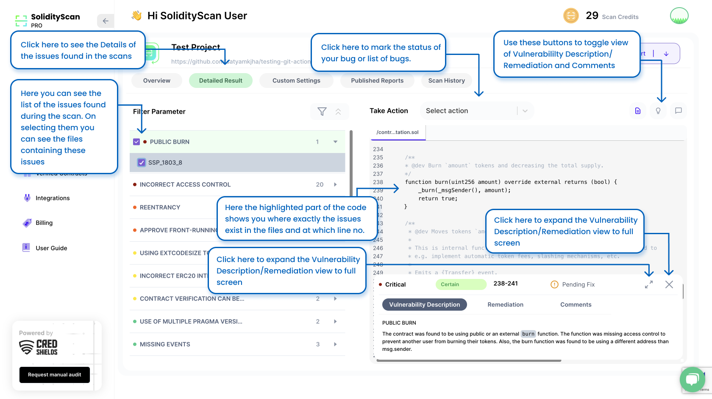

##### Filtering bugs using Confidence/Vulnerability Parameter and Bug Status

There might be times where our tool might detetct a lot of vulnerabilities in your code. To find and focus on what is important for you, you can filter the issues/vulnerabilities/bugs based on the following paramenter:

1. Severity of Vulnerability: (High, Critical, Medium, Low, Info, Gas)
2. Confidence rating of Vulnerabilty Detector: (Certain, Firm, Tentative)
3. Vulnerabilities Flag of bug status : (Won't Fix, False Positive, Pending Fixes)

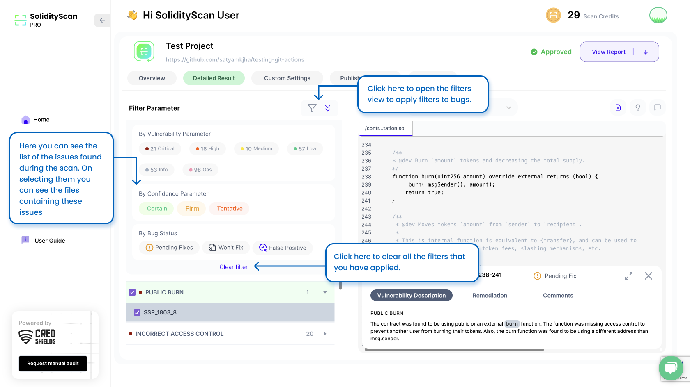

##### Updating Bug Status

We have a functionality where we keep a track of the status of the bugs present. You can update the status of the vulnerabilities found in the scan basis to track the work.

Here we ask a bit of your help to update the status of the vulnerabilities found so that we can improve our scanner engine to give better results. All the Vulnerabilities in your code are listed here, along with their status. Click on any one of the vulnerabilities, and you will find the list of files containing these vulnerabilities along with their status. You also have an option to multiple select issues or batch of issues together and mark their status atr once.

If you feel you don't need to fix this vulnerability and it is better the way it is, please mark the status as Won't fix. To mark wont-fix status you also have to add a comment while doing it explaining why there isn't a need to fix the vulnerablity.

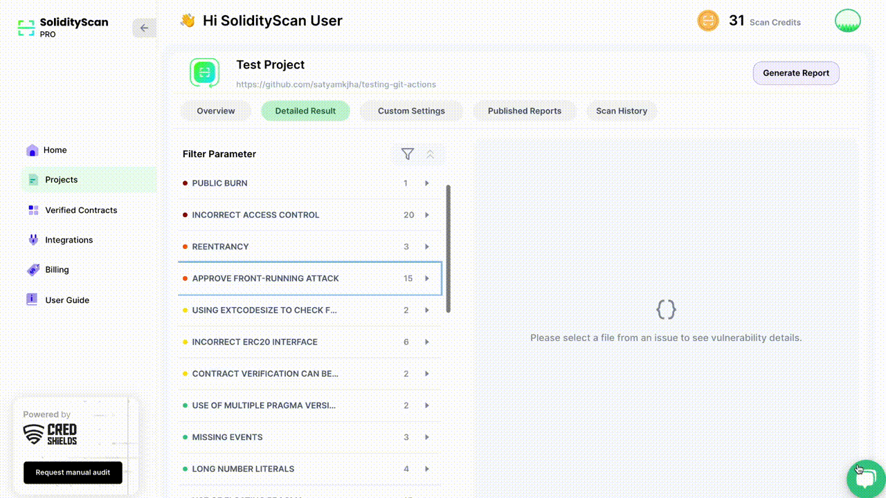

If you feel that the vulnerability found is a False Positive, Please mark that.

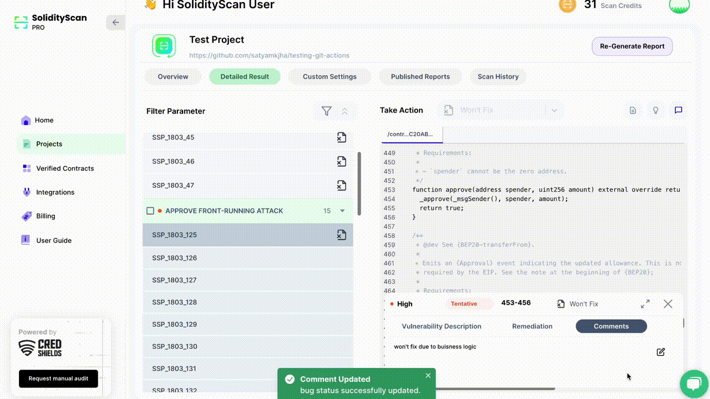

There is also an option to reset a bug status to default again if you feel if you might need to fix it.

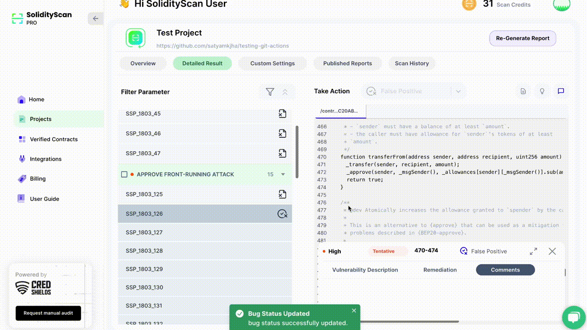

The scanner automatically updates the status of bugs found to be fixed after performing the rescan.

##### Updating Comments on Bug

You can also update comments on your comments done on a bug.

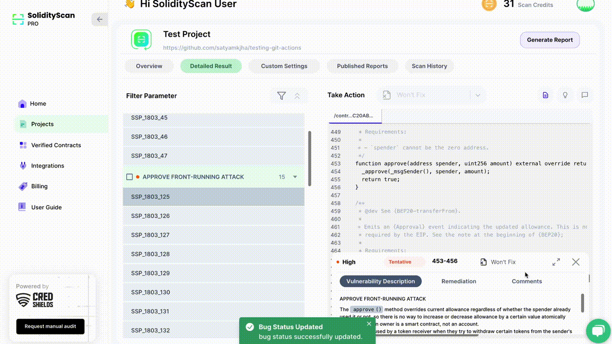

#### Configure Settings of a Project

You can Configure Settings on a Project for future scans. There are functionalities to update directories and files to be scanned and also to enable ans disable webhooks for automatic scans.

##### Update Files to be Scanned

You can update the files and folders that are to be scanned by selecting the checkboxes and clicking on <i>Update</i> Button. The files that you have not selected will be skipped and will not be scanned in future.

###### Note: Only solidity files (files with .sol, .Sol extension) will be scanned. Files that will not be scanned will not be highlighted

##### Update Webhook Settings for Github Actions

You have the option to trigger automatic scans using Github Actions. Whenever a new commit will be pushed to the branch, if webhook has been enabled then it will trigger a scan automatically to check if the new changes have any vulnerabilities present.

You can only configure webhooks for those github respository which are owned by you (user). Also this funcationality is only possible once you have connected your github account with SolidityScan Application. [Here](./integrations) are the steps to do the.

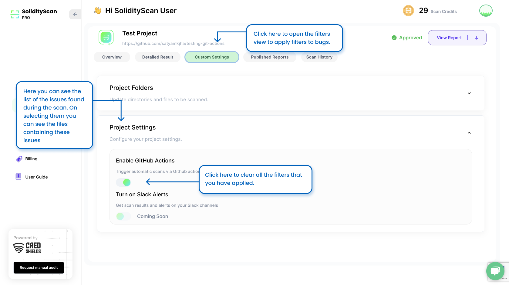

#### View History of Scans

You can see the history of the scans done for this project here. All the re-scans done can be seen here. You will also be able to see which files from your projects were scanned for this scan.

Click on any one of the <i>View Scan Result</i> to view the result for that scan.

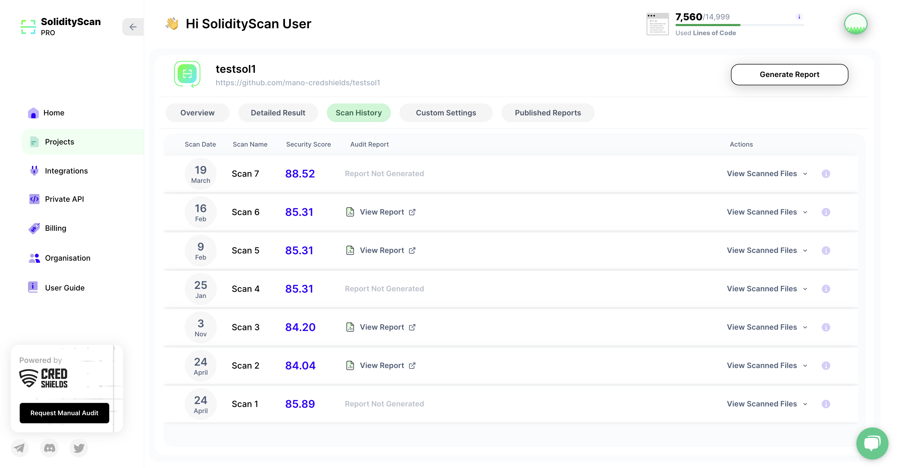
