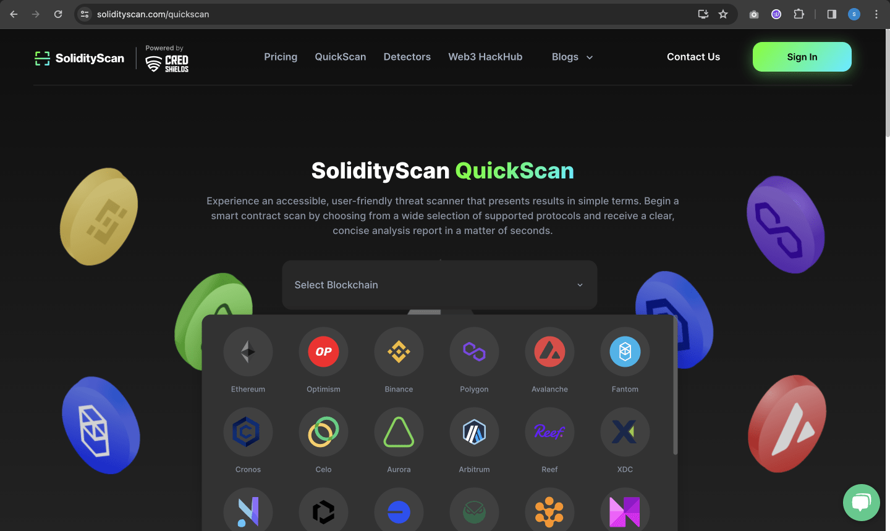
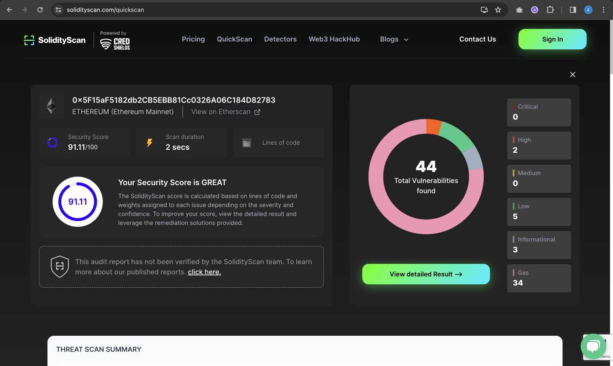
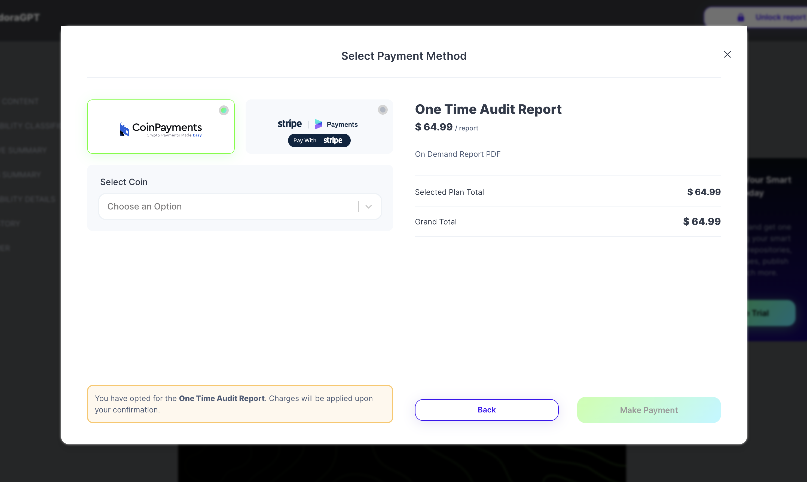

# Quickscan

We also provide the functionality to do a Quickscan for a particular deployed contract whose codes are published on the supported explorers. The current supported chains and their respective explorers are as below.

1. [Ethereum - (etherscan.io)](https://etherscan.io/)
2. [BSC - (bscscan.com)](https://bscscan.com/)
3. [Polygon - (polygonscan.com)](https://polygonscan.com/)
4. [Fantom - (ftmscan.com)](https://ftmscan.com/)
5. [Avalanche - (snowtrace.io)](https://snowtrace.io/)
6. [Cronos - (cronoscan.com)](https://cronoscan.com/)
7. [Arbiscan - (arbiscan.io)](https://arbiscan.io/)
8. [Celo - (celoscan.io)](https://celoscan.io/)
9. [Aurora - (explorer.aurora.dev)](https://explorer.aurora.dev/)
10. [ReefScan - (reefscan.com)](https://reefscan.com/)
11. [Optimism - (optimism.io)](https://www.optimism.io/)
12. [Buildbear - (buildbear.io)](https://buildbear.io/)
13. [XDC - (xdc.blocksscan.io)](https://xdc.blocksscan.io/)
14. [Blockscout - (blockscout.com)](https://www.blockscout.com/)
15. [Routescan - (routescan.io)](https://routescan.io/)

#### Doing a Quickscan for a Verfied Smart Contract

##### Step 1: Enter the details of the contract

Head over to the [Quickscan Page](https://solidityscan.com/quickscan)

Enter the link to the contract from the ledger. Select the blockchain platform on which this transaction has taken place. Also, select the contract chain for this transaction.

###### Please follow the constraints below to avoid scan failure:

1. Navigate to the explorer of the particular blockchain (Ethereum - Etherscan.io).
2. Use the search bar to get your smart contract and check if the source code is verified in the "Contract" tab of the selected explorer.

##### Step 2: View the results of the scan

On successful completion of the scan, you will be taken to the result section.

You can see an overview of the scan done here.

It also gives you a Threat Scan Summary which identifies potential rug pull scams by providing an in-depth analysis of a smart contract's code

##### Step 3: View Recent Scans List

You can also see the recent scans done using Quickscan.

#### Importing QuickScan Details to your Account Dashboard

1.  Click on the Bug Count box thats avaialble when the result for your quickscan comes.
    

2.  Click on View Detailed Result.
    

3.  You will be redirected to the home page and asked for a confirmation to import a scan. Click on Confirm
    

#### Generating Report for your Quickscan Result

1. Click on View Audit Report PDF
   

2. Click on Unlock Report
   

3. Please enter your Email.
   

4. Please select the Payment Method Type and make your payment.
   

5. Once your payment is done. Please wait for a while and go to your email to download your report.

6. Please click on download link recieved in your mail. Plese enter your email to confirm.
   

7. Please click on Download Report.
   
