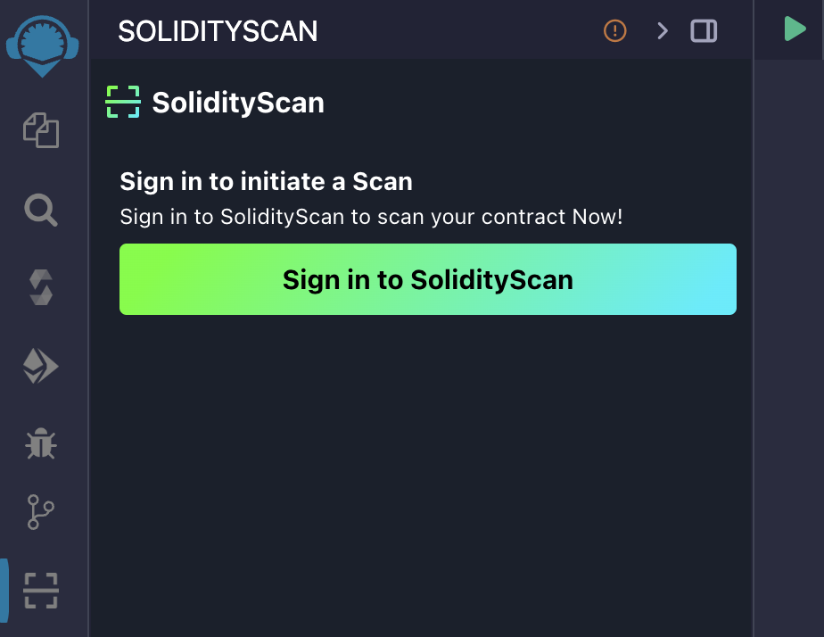

# SolidityScan Remix Plugin

SolidityScan Remix plugin provides scanning capabilities for Solidity smart contracts. It allows you to scan a single .sol file, folder or an entire workspace and gives a security profile for your contract with a security score, vulnerability distribution according to criticality levels & highlights the lines of code containing the vulnerabilities.

#### Features

- Scan any File or Folder: Allows you to scan any Solidity file or folder for vulnerabilities.
- Scan Entire Workspace: Allows you to scan the all the solidity files in the existing workspace for a comprehensive security profile.
- Vulnerability distribution: Displays all types of vulnerabilities detected in the file distributed according to criticality levels.
- Detailed results: Shows descriptions & remediations for the detected vulnerabilities along with highlighting the piece of code where they are present.
- Gas optimizations: Gives you possible ways of optimising your Solidity files for gas.

Please see the following example to get an understanding on how to use the extension.

#### Installation

1. Click on RemixIDE Plugin Manager Icon.
2. Search for "SolidityScan".
3. Click on Activate.

#### Configuration

To use SolidityScan, you will need to Login into SolidityScan.

1. Locate SolidityScan in sidebar and click on Sign in to SolidityScan.
2. Once the sign-in link is generated, copy and paste the link in a new browser tab and sign in.
3. Upon successful authentication, please return to Remix.
4. You are now logged in and can start scanning your Solidity code.

#### Usage

##### Start Scanning

- Select any .sol file or folder and click on Start Scanning.
- To scan the entire workspace just click on Start Scanning without any selection.

##### Explorer View

SolidityScan provides an explorer view in the activity bar with the 'Analysis' view. When an API token is provided, it displays a breakdown of vulnerabilities:

- Critical
- High
- Medium
- Low
- Informational
- Gas

