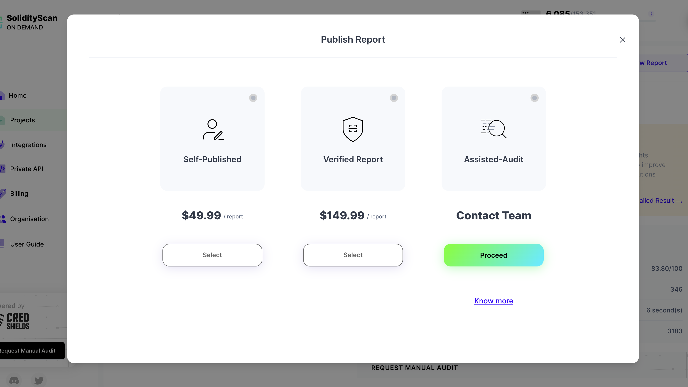
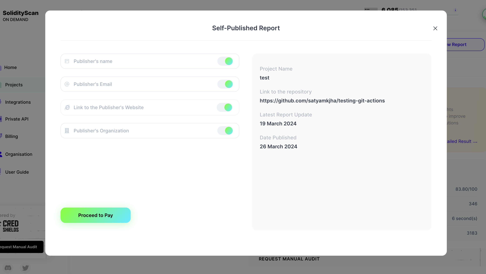

# Generate a Report for the Scan Done

Once a scan is completed, you have the option to generate and publish a report of the scan. Follow these steps to do so:

## Step 1: Generate the Report

First, scan a project or a deployed contract. If you haven't scanned anything yet, head over here to [scan a project](/project/) or here to [scan a deployed contract](/block/) or to [scan a file](/filescan/).

Once you have finished scanning a project, deployed contract, or file, click on the "Generate Report" button.

After generating the report, you will have the option to view it.

## Step 2: Publish Your Report

Once you have reviewed the report and updated its results, you can publish it for sharing.

To publish a report, click on the "Publish Report" button.

You can publish two types of reports:

1. **Self-Published Reports**: In this report, you take responsibility for identifying and documenting false positive bugs.
2. **Verified Reports**: This report undergoes verification by our security team.

When you click on the "Publish Report" button, you will be given three options:

- **Self Publish Report**: You can self-publish this report.
- **Publish a Verified Report**: Get the report verified by our security team.
- **Publish the Report after an Assisted Audit**: Our security team will audit the report's findings and assist in publishing it.

Select one of the options above and confirm.

You will see a form with prefilled data, containing general information about the report. After reviewing it, click "Next" to proceed.

Enter the contact information for the person or organization publishing the report. You can choose to make the information private or public. Once done, make the payment if the service is not available in your current plan. Click on the "Publish Report" button to submit your request.

## Step 3: Explore Published Reports

You can view the history of published reports for different scans here. Once you have submitted a request for publishing your report, you can track its status here.

Once your request is approved, you can view your report and copy the Public URL.

## Step 4: Download Report

Once your report is published and approved, you can download it as a PDF and share it offline.
