# Generate a report for the scan done

Once a scan is done, you have the option to generate and publish a report of the scan. You need to follow the following step to do so:

# Step 1: Generate the Report

First, Please scan a project or a deployed contract. If you have not scanned anything yet, then head over here to [scan a project](./project) or here to [scan a deployed contract](./block).

Once you have finished scanning a project or a deployed contract, click on Generate Report button, as shown below.

[Report Gen 1](./assets/images/Report Gen 1.png)

# Step 2: View your Report

Once you have generated the report, you will have the option to View your Report and Update it. Click on the "View Report" button to view your Generated Report.

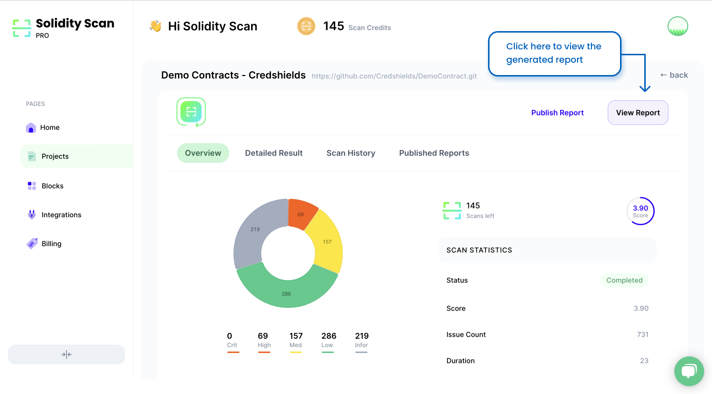

You can view the following section in your report.

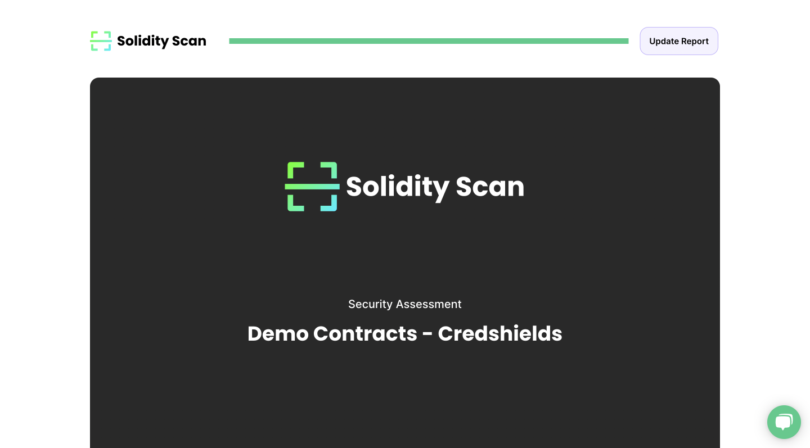

There is a section to view the complete summary of the vulnerabilities found.

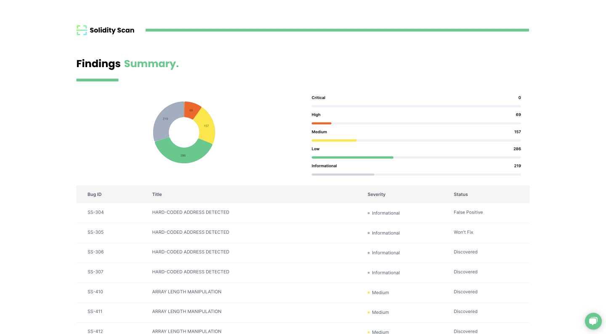

You can also see the History of the Scans conducted for that project.

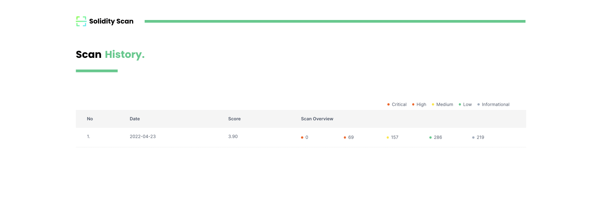

You can also see the list of all the vulnerabilities found during the latest scan in the report.

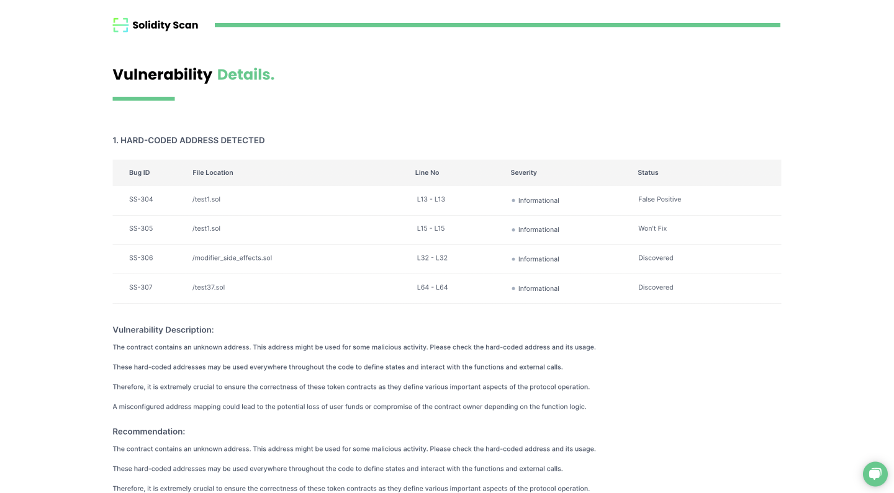

# Step 3: Update the Report

After you have completed going through the report, you can update the status of the vulnerabilities found in the scan. The scanner automatically updates the status of bugs found to be fixed after performing the rescan. 

If you do not want to update the status of any vulnerabilities you can skip this step and procced to Step 4.

To update the Report, Click on the Update Report button.

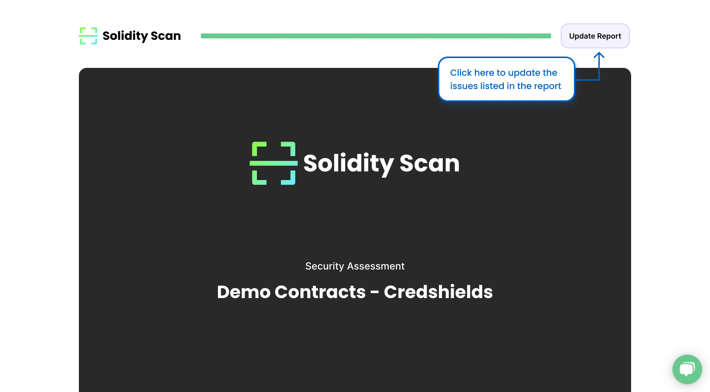

Here we ask a bit of your help to update the status of the vulnerabilities found so that we can improve our scanner engine to give better results. All the Vulnerabilities are listed here, along with their status. Click on any one of the vulnerabilities, and you will find the list of files containing these vulnerabilities along with their status. If you feel that the vulnerability found is a False Positive, Please mark that, or if you feel you don't need to fix this vulnerability and it is better the way it is, please mark the status as Won't fix.

Once you are done, Please Click on the Update Report button at the bottom, as shown below.

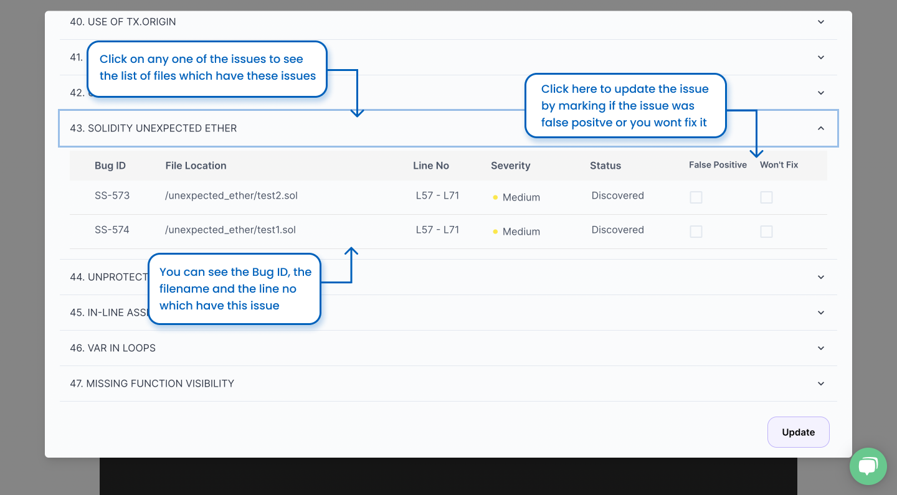

Once you have updated the report, the status of these vulnerabilities will get updated, and the newly updated status will be shown in the report thereafter.

# Step 4: Publish Your Report

Once you have gone through the report and updated its results, you also have an option to Publish a report for the scan that was carried out so that it can be shared with anyone.

To Publish a Report, Click on the Publish Report button as shown below.

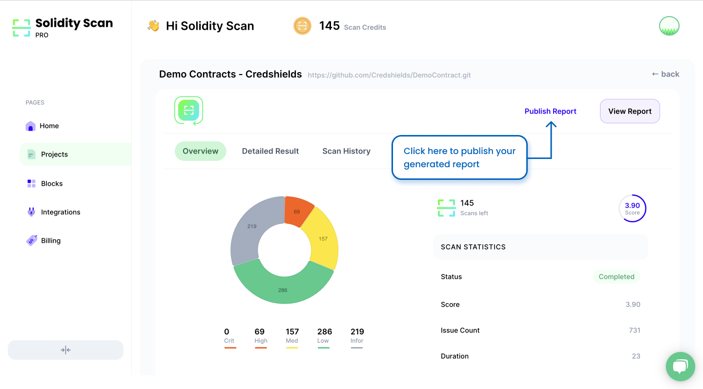

You will see a form with prefilled data. It contains some general information about the Report. After reviewing it once, click on Next to go to the final page of the form.

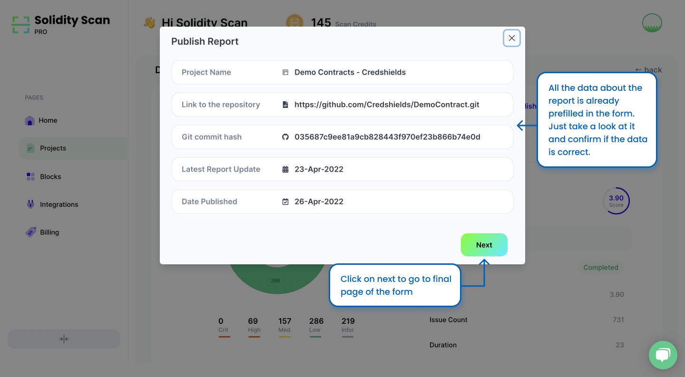

Enter the contact information of the person or organization publishing the report. You can choose to make the information private or public. Once done, click on Publish Report button to submit your request for Publishing your Report.

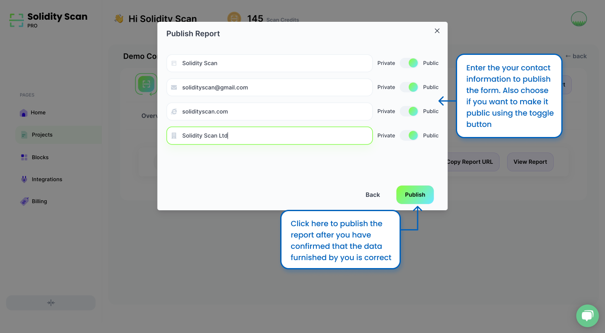

Once our team has reviewed the report, the report for publishing your Report will be approved, and it will be published.

# Step 5: Explore Published Reports.

You can see the history of the Published Reports for different Scans here. Once you have submitted a request for publishing your report, you can see the report here, along with the status of your request.

Once your request is approved, you can view your report here and also copy the Public URL of your report from here.

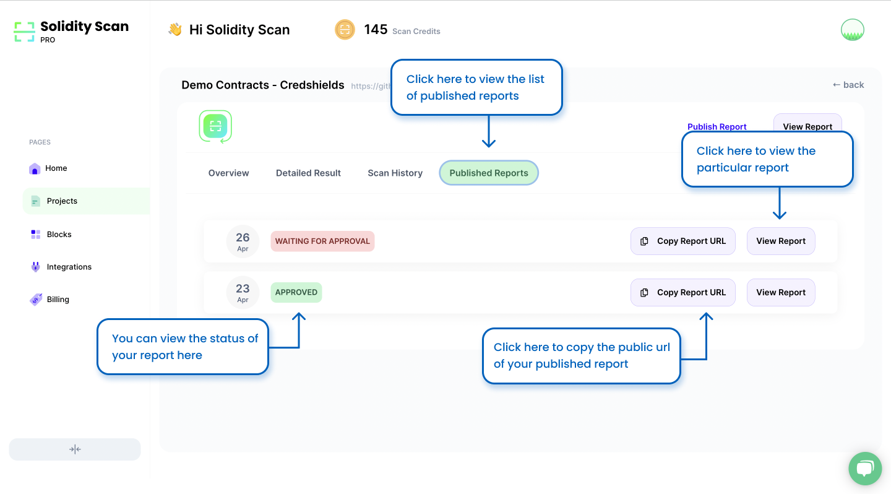
