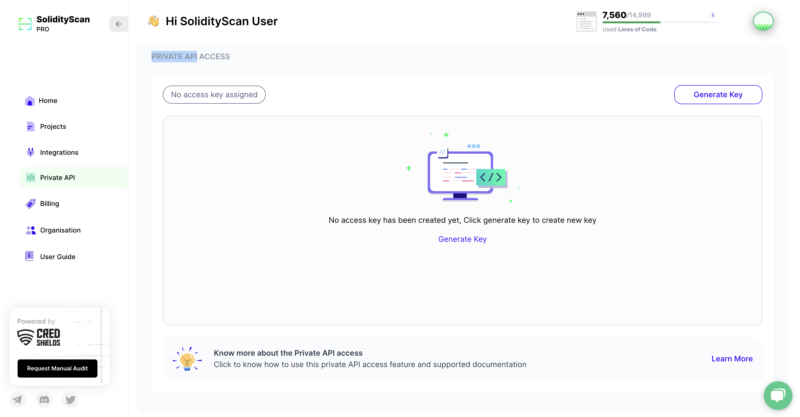
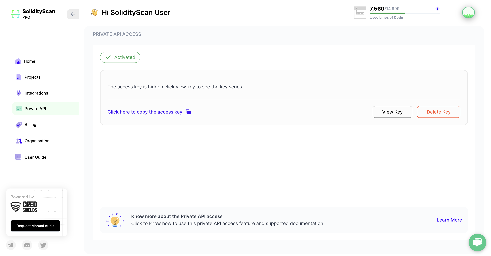

Now you can scan your Solidity contracts using our CLI tool.
Introducing our SolidityScan SDK for streamlined smart contract scanning! With our SDK, you can effortlessly scan your solidity contracts for vulnerabilities.

#### Get your API keys

To utilize our SDK, you need your own personal API key. Please follow the steps below to obtain your API Key:

1. Please select the PRIVATE API tab and click on the Generate Key Button.
   

2. Click on the copy button to copy the access key.
   

3. If you suspect that your key has been compromised, you can delete it and generate a new one.

Your API requests are authenticated using API keys. Any request that doesn't include an API key will result in an error.

#### Install your API Access key

You can find your Access Key from your SolidityScan PRIVATE API tab anytime.

Install your access key by using the command below directly.

```
solidityscan config add-update-config --token='youraccesskey'
```

This command will create a configuration file at the default location for your system. If a config file already exists, it will overwrite the access key in that file.

### Download or Install the SDK

The best way to interact with our API is to use pip.

```
pip install solidityscan
```

### Features

- **Project Scan:** Scan your public and private repositories hosted on Github.
- **Verified Contract Scan:** Initiate scans on contracts deployed both on Testnets and Mainnets. SolidityScan currently supports Ethereum, Binance, Polygon, Avalanche, and Fantom.

### Examples

#### Perform a Project Scan

```
solidityscan scan --scan-type="project" -project-url="https://github.com/testrepo" -project-branch="main" -project-name="testname"
```

#### Perform a Verified Contract Scan

```
solidityscan scan --scan-type="contract" -contract-address="0x633bA1eeDbE63a779Eca6A1EbE86908Ac2710D0b" -contract-chain="mainnet" -contract-platform="etherscan"
```

### Adding or Updating token to config

```
solidityscan config add-update-config --token='yourtoken'
```

### Setting default error language (defaults to English (en))

```
solidityscan config add-update-config --error-language='es'
```

### Error codes

- 000x: Errors raised by the server
- 100x: Errors raised by the SDK
